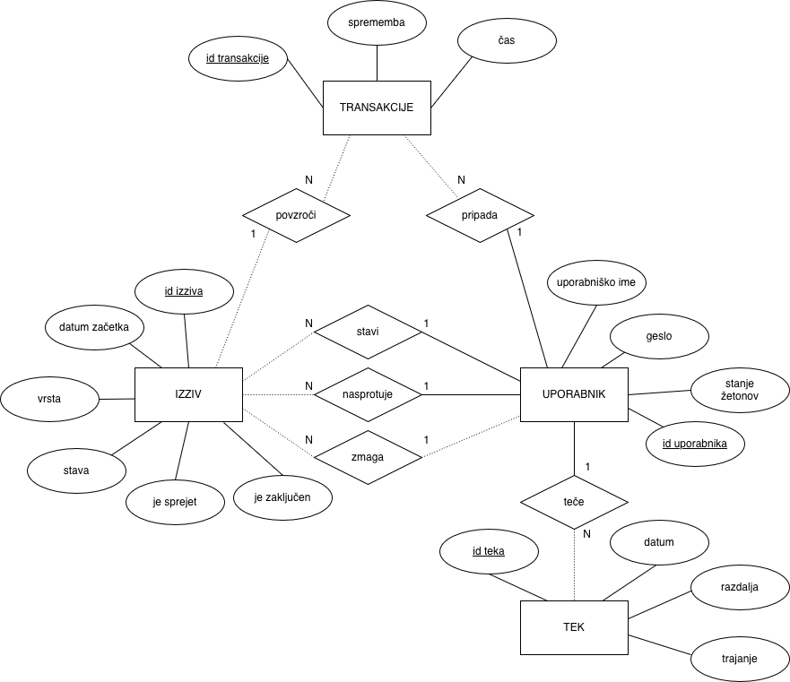

# RunDuel
RunDuel je spletna aplikacija pri predmetu **Osnove podatkovnih baz**, kjer uporabniki med seboj tekmujejo v tekaških izzivih, pri katerih stavijo kovance. Vsak uporabnik ob registraciji prejme 100 kovancev, nato pa se lahko prijavi na izziv skupaj z enim prijateljem. Oba uporabnika stavita enako količino kovancev, po koncu izziva pa zmagovalec prejme kovance nasprotnika. Cilj aplikacije je zmagovati v izzivih in zbrati čim več kovancev. Uporabniki tedensko dobijo 100 kovancev.

Podprte vrste izzivov so:
- najhitrejši čas na 5 km
- najhitrejši čas na 10 km
- najhitrejši čas na 21,1 km
- najhitrejši čas na 42,2 km
- največja pretečena razdalja

V izzivih vrste najhitrejši čas zmaga uporabnik, ki ima najhitrejši povprečni tempo na dano razdaljo. V izzivu vrste največja pretečena razdalja zmaga uporabnik, ki v časovnem obdobju enega tedna preteče večjo razdaljo v okviru poljubnega števila tekov.

Vsak izziv traja 1 teden. Sistem beleži uporabnike, teke, izzive, stave, transakcije in trenutno stanje kovancev.

## ER Diagram


## Namestitev in zagon projekta

### Zagon prek Binderja

Aplikacijo lahko najlažje preizkusite prek Binderja:

[](https://mybinder.org/v2/gh/tilenzabkar/OPB-RunDuel/main?urlpath=proxy/8080)

Binder bo samodejno pripravil okolje in zagnal aplikacijo.

### Priprava okolja

Priporočljivo je, da ustvarite navidezno okolje:

```bash
python3 -m venv venv
source venv/bin/activate
```

Namestite vse potrebne knjižnice:

```bash
pip install -r requirements.txt
```

### (Opcijsko) Pridobitev Strava API ključev

Odprite `.env` datoteko in vnesite svoje podatke za Strava API. Ti podatki za navadno delovanje aplikacije niso potrebni, so pa potrebni za sinhroniziranje tekov iz Strave. Za nadaljnja navodila obiščite [Strava API dokumentacijo](https://developers.strava.com/docs/getting-started/).

```env
STRAVA_CLIENT_ID=tvoj_client_id
STRAVA_CLIENT_SECRET=tvoj_client_secret
```

### (Opcijsko) Inicializacija podatkovne baze

> Ta korak je potreben samo pri prvi postavitvi aplikacije na novi podatkovni bazi.

```bash
python init_db.py
```

### Zagon aplikacije

Aplikacijo zaženete z:

```bash
python Presentation/app.py
```

Odprite brskalnik in pojdite na **http://localhost:8080**.

## Uporaba aplikacije

## Registracija in prijava

- Ustvarite si uporabniški račun z uporabniškim imenom in geslom.
- Po registraciji prejmete 100 kovancev.

Lahko se tudi prijavite z že obstoječimi podatki.

## Dodajanje tekov

Po prijavi lahko svoje teke dodajate na dva načina:

### Ročni vnos
Pri ročnem vnosu na gumbu **Dodaj tek** pod `/runs` vnesete:
- datum teka,
- razdaljo,
- čas.

### Uvoz iz Strave
1. Kliknite na **Uvozi iz Strave** na (`/runs` ali `/dashboard`)
2. Prijavite se v Stravo in odobrite dostop
3. Teki se bodo uvozili v aplikacijo

Opomba: Če se uporabnik želi še z drugim računom prijaviti v Stravo, mora najprej klikniti na **Odjava iz Strave**, sicer ima lahko težave s piškotki, ki jih shranjuje Strava.

## Izzivi

### Ustvarjanje izziva

1. Odprite stran **Izzivi**.
2. Kliknite **Nov izziv**.
3. Izberite:
   - nasprotnika,
   - vrsto izziva,
   - višino stave.
4. Pošljite izziv.

Ko nasprotnik izziv sprejme, postane **aktiven**.

### Trajanje izziva
- Vsak izziv traja **7 dni**.
- Po preteku obdobja se samodejno zaključi, uporabnik ga lahko tudi predčasno zaključi.

Ob zaključku se določi zmagovalec izziva in se mu izplača stava. V primeru remija se stave povrnejo.

## Lestvica uporabnikov

Na strani **Uporabniki** je prikazana lestvica vseh uporabnikov.

- Uporabniki so razvrščeni po številu kovancev.
- Prikazani so od najbogatejšega do najrevnejšega.


## Tedenski bonus

- Vsak ponedeljek ob **00:00** vsi uporabniki prejmejo **100 kovancev**.
- Bonus se vsakemu uporabniku dodeli največ enkrat na teden.

## Samodejno zaključevanje izzivov

- Vsako minuto se preverijo vsi aktivni izzivi.
- Samodejno se zaključijo tisti, ki trajajo več kot **7 dni**.
